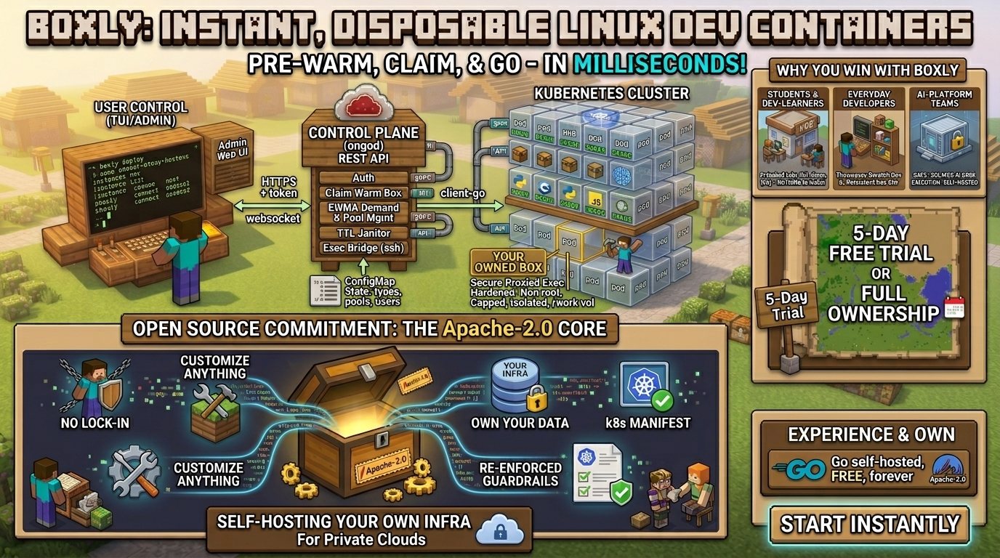

<div align="center">



# Boxly

**Instant, disposable Linux dev containers — pre-warm, claim & go, in milliseconds.**

[](LICENSE)
[](go.mod)
[](#-deploy)
[](#)

*Open a terminal, get a real Linux box in a second — pre-loaded for whatever you're doing.
Learn, build, or run code. Self-hosted on your own Kubernetes. No lock-in.*

</div>

---

> ℹ️ **About the banner:** the "5-day free trial / full ownership" framing on the artwork is a
> *hosted-product* concept and is **out of scope for this open-source project**. Boxly itself is
> **100% open source (Apache-2.0), self-hosted, and free forever** — you run it on your own
> cluster and own your data. There is no trial, license key, or paywall in this repo.

## Table of contents
- [What is Boxly](#-what-is-boxly)
- [Features](#-features)
- [Architecture](#-architecture)
- [Quickstart](#-quickstart)
- [Box types (templates)](#-box-types-templates)
- [The CLI / TUI](#-the-cli--tui)
- [Admin console](#-admin-console)
- [Multi-user & onboarding](#-multi-user--onboarding)
- [Public live-pools page](#-public-live-pools-page)
- [Configuration](#-configuration)
- [Deploy](#-deploy)
- [Security model](#-security-model)
- [Project layout](#-project-layout)
- [Roadmap & out of scope](#-roadmap--out-of-scope)
- [Contributing](#-contributing)
- [License](#-license)

## ✨ What is Boxly

Spinning up a clean, ready-to-use Linux environment is still slow and annoying — students fight
`apt install` instead of learning, devs want a throwaway box *now*, and AI tools need a safe place
to run code.

Boxly hands out **pre-warmed, hardened containers that feel like instant VMs**. A small control
plane keeps a pool of boxes warm and sized to live demand; when you ask for one, it **claims a
ready box in milliseconds** instead of cold-starting. You drop straight into a shell that *feels*
like SSH but is a securely-proxied `exec` into a locked-down pod.

It runs on **your own Kubernetes** — your cloud, your data, your bill.

## 🚀 Features

- **Instant boxes** — a pre-warmed pool means `create` is a sub-second claim, not a cold start.
- **Predictive, per-type pools** — an EWMA of create demand auto-sizes each box type's warm pool
  (min/max bounds, idle decay). Warm boxes are pre-prepared (setup applied) so even templated
  boxes are instant.
- **Prebaked box types** — Normal VM, Learn: Linux / Git / SQL, Dev: Python / Node, and **custom
  types** you define in the admin console (image + setup script + free-hand Pod manifest).
- **Two lifecycles** — *disposable* (auto-expires via TTL) or *persistent* (PVC-backed, survives
  restarts).
- **Multi-user (RBAC)** — per-user API tokens; each user only sees & controls **their own** boxes.
  Admin sees everything and can force-stop any box.
- **Onboarding validity** — users are valid for N days (default 5, configurable, with a cap);
  expired tokens are rejected; the TUI shows "days left".
- **Free-hand Kubernetes manifests with guardrails** — admins fully control image/env/resources,
  while Boxly **re-enforces** non-root, dropped caps, seccomp, a service account, labels and the
  workspace volume on every box.
- **Image pull secrets** — paste a `dockerconfigjson` Secret in the admin UI; Boxly applies it and
  references it on every box.
- **Pixel/voxel UIs** — a Minecraft-themed Bubble Tea **TUI** for users and an embedded **web admin
  console**, plus a **public live-pools page** anyone can watch.
- **Single binary** — the web UI is `go:embed`-ed into the server, so it's **one container, one
  pod** (no separate frontend).

## 🏗 Architecture

```
 boxly (CLI / TUI)  ──HTTPS + bearer token──▶  boxlyd (control plane)  ──client-go──▶  Kubernetes
   create/list/ssh/exec/run                      REST API + exec(ws) bridge              warm Pods / persistent
   live dashboard (TUI)                           predictive pool + TTL janitor          Deployments + PVCs
   /admin (web), /pools (public)                  per-user RBAC, ConfigMap state         namespace: boxly
```

- **`boxlyd`** — the control plane. REST API, websocket exec/ssh bridge, the warm-pool reconciler,
  the demand tracker (EWMA), the TTL janitor, and the embedded admin + pools web pages.
- **`boxly`** — the CLI. Bare `boxly` opens the full-screen TUI dashboard; subcommands cover
  `vm create/list/rm/info`, `ssh`, `exec`, `launch`, `admin`, `dash`.
- **State lives in Kubernetes** — boxes are labelled Pods/Deployments; runtime config + custom
  templates + users persist in a single `boxly-config` ConfigMap. No database.

## ⚡ Quickstart

You need **Go 1.26+**, **kubectl**, and a cluster. For local dev, [Colima](https://github.com/abiosoft/colima)
with k3s works great (no Docker Desktop):

```bash
colima start --runtime containerd --kubernetes --vm-type=vz   # or: minikube start
kubectl apply -f deploy/boxly.yaml                # namespace, SA, RBAC, NetworkPolicy

# Terminal 1 — control plane (uses your kubeconfig locally)
BOXLY_TOKEN=dev-secret BOXLY_ADMIN_TOKEN=admin-secret BOXLY_NAMESPACE=boxly \
  go run ./cmd/boxlyd
```

```bash
# Terminal 2 — the client
export BOXLY_SERVER=http://localhost:8080 BOXLY_TOKEN=dev-secret
go run ./cmd/boxly          # opens the TUI: press [n] to launch a box, [↵] to connect
```

- **Admin console:** http://localhost:8080/admin  (token `admin-secret`)
- **Public live pools:** http://localhost:8080/pools

## 📦 Box types (templates)

Pick one in the TUI (`n`) or with `--template`:

| id | what you get |
|----|--------------|
| `normal` | clean Ubuntu box (instant — claimed from the warm pool) |
| `learn-linux` | a text-adventure dungeon to learn `cd`/`ls`/`cat` |
| `learn-git` | a seeded git playground + challenges |
| `learn-sql` | a mini SQL murder mystery in SQLite |
| `dev-python` | Python + pip |
| `dev-node` | Node + npm |

Add your own under **Admin → Box Types** (image + optional setup script + an optional free-hand Pod
manifest). They appear in the launcher and get their own warm pool.

## 🖥 The CLI / TUI

```bash
boxly                                   # full-screen TUI dashboard (your boxes)
boxly vm create --template learn-git    # headless create
boxly vm list                           # list your boxes
boxly ssh <id>                          # interactive shell
boxly exec <id> -- <cmd>                # one-shot command
boxly launch                            # interactive picker (non-TUI)
boxly admin                             # open the admin web console
```

In the **TUI**: `↑/↓` move · `n` new (pick type → disposable/persistent → name → launch) ·
`↵` connect · `d` delete · `r` refresh · `q` quit.

## 🛠 Admin console

The web admin at `/admin` (separate `BOXLY_ADMIN_TOKEN`) gives you:
- **Containers** — every live box across all users (owner, type, pod name) with **force-stop**.
- **Pools** — live warm/occupied/desired per box type.
- **Box Types** — create/edit types: form config + a live **Kubernetes manifest** editor (guardrails
  re-applied on save).
- **Users** — issue per-user tokens, copy their connect command, set validity.
- **Settings** — pool bounds, defaults, onboarding days, image pull secret; namespace is shown
  read-only.

## 👥 Multi-user & onboarding

- Each user is identified by a **bearer token** → an *owner*. The legacy `BOXLY_TOKEN` maps to the
  `default` user.
- Users are **scoped to their own boxes** (list/connect/delete); the admin sees all.
- **Onboarding validity:** new users are valid for `BOXLY_USER_DAYS` (default 5), capped by
  `BOXLY_MAX_USER_DAYS`. Expired tokens are rejected; the TUI shows days remaining.
- Connect command shown per-user in the admin UI:
  `BOXLY_SERVER=<url> BOXLY_TOKEN=<token> boxly`

## 🌍 Public live-pools page

`/pools` is a **no-login** page (big logo + live cards) so anyone can watch the warm pools breathe —
demand-driven, auto-tuning, in real time. Backed by aggregate-only data (no names or box IDs).

## ⚙ Configuration

`boxlyd` reads env at boot; most values are then **runtime-editable in the admin console** and
persisted to the `boxly-config` ConfigMap (which overrides env on subsequent boots).

**Secret (set strong values):**
| Var | Required | Meaning |
|---|---|---|
| `BOXLY_ADMIN_TOKEN` | ✅ | admin console / admin API token |
| `BOXLY_TOKEN` | ✅ | bootstrap user-API token (= `default` user) |

**Config (optional — seed defaults):**
| Var | Default | Meaning |
|---|---|---|
| `BOXLY_NAMESPACE` | `boxly` | namespace boxes are created in |
| `BOXLY_ADDR` | `:8080` | listen address |
| `BOXLY_POOL_MIN` / `BOXLY_POOL_MAX` | `0` / `5` | warm-pool bounds per box type |
| `BOXLY_POOL_DECAY` | `0.7` | demand EWMA decay |
| `BOXLY_DEFAULT_IMAGE` | `ubuntu:24.04` | base image |
| `BOXLY_DEFAULT_TTL` | `1h` | disposable box TTL |
| `BOXLY_USER_DAYS` / `BOXLY_MAX_USER_DAYS` | `5` / `30` | onboarding validity + cap |
| `BOXLY_PULL_SECRETS` | — | comma-separated pull-secret names |
| `KUBECONFIG` | — | local dev only; in-cluster uses the pod ServiceAccount |

## 🚢 Deploy

Boxly is a single static binary with the UI embedded → **one image, one pod**.

```bash
docker build -t <registry>/boxly:latest .
```

**On Kubernetes** (reference manifests in `deploy/`):
```bash
kubectl apply -f deploy/boxly.yaml   # namespace + boxlyd SA + RBAC + NetworkPolicy
# edit the image + tokens, then:
kubectl apply -f deploy/boxly.yaml           # Deployment + Service + ConfigMap + Secret
```
The pod runs as the **`boxlyd`** ServiceAccount (RBAC scoped to pods/pvc/configmaps/secrets/
pods-exec/deployments in its namespace) and uses in-cluster config — no kubeconfig needed.

**With [Devtron](https://docs.devtron.ai/):** create an app → *Build from source* with
**Dockerfile path `Dockerfile`** and **build context `.`** → Deployment template with
**containerPort `8080`** and **`serviceAccountName: boxlyd`** → map the env above via a **ConfigMap**
(non-sensitive) + **Secret** (tokens) mounted as environment variables → expose `/admin` and
`/pools` via an Ingress with TLS. Apply `deploy/boxly.yaml` once in the target namespace
first (Devtron's chart doesn't create the Role/RoleBinding).

> Run a **single replica** — there's no DB and the pool reconciler assumes one writer.

## 🔒 Security model

- Every box runs **non-root** (uid 1000), `allowPrivilegeEscalation: false`, **all capabilities
  dropped**, `seccompProfile: RuntimeDefault`, **no service-account token**, resource limits, and a
  **deny-ingress NetworkPolicy**. Free-hand manifests can't weaken these — they're re-enforced.
- The exec/ssh bridge proxies through the API server (not the pod network).
- **Note:** plain pods share the host kernel. For *untrusted* code, run boxes under a sandboxed
  runtime (gVisor / Kata) via a RuntimeClass — see the roadmap.

## 🗂 Project layout

```
cmd/boxlyd/         control-plane entrypoint
cmd/boxly/          CLI entrypoint
internal/server/    HTTP API, exec bridge, admin endpoints, embedded web UI (admin + /pools)
internal/vm/        box ⇄ Kubernetes translation, hardened specs, guardrails
internal/pool/      predictive warm-pool reconciler
internal/demand/    per-template EWMA demand tracker
internal/template/  box-type registry (builtins + custom)
internal/settings/  runtime config store (ConfigMap-backed)
internal/tui/        Bubble Tea dashboard
internal/cli/        cobra commands + interactive launcher
deploy/             namespace/RBAC + reference Deployment
Dockerfile          single-image build (UI embedded)
```

## 🧭 Roadmap & out of scope

**Planned:** sandboxed runtime (gVisor/Kata) for untrusted code, `boxly run` one-shot, port-forward
to a box, Helm chart, Prometheus `/metrics`, snapshots, OIDC.

**Out of scope for this repo:** any hosted/SaaS offering, billing, free trials, or license keys —
Boxly is self-hosted and free under Apache-2.0.

## 🤝 Contributing

Issues and PRs welcome. `go build ./...`, `go test ./...`, and `gofmt` should stay green. Bundled
learning content uses third-party open-source tools — please respect their licenses.

## 📄 License

[Apache-2.0](LICENSE).
